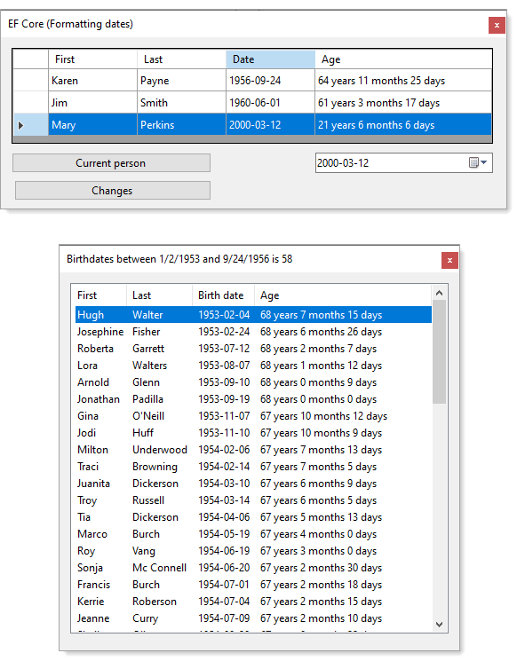

# Entity Framework Core working with dates

Provides several useful examples for working with `dates` in `Entity Framework Core 5`, `SQL-Server` using C# with Windows Forms although the base code presented can be used in other project types.

### More samples will be added over time.



This solution provides:

- Code sample to display a DateTimePicker in a DataGridView loaded using Entity Framework Core 5.
  - From the basic code shown, it's easy to provide add, edit, delete, filtering and searching which are not shown to keep things basic. Several other projects will be added to step through add, edit, delete, filtering and searching building up the initial code sample.
- Code sample for obtaining data using an extension methof for dates between a specific date. 


The code sample has been built off the following two repositories.

- [WinForms DataGridView with EF Core 5](https://github.com/karenpayneoregon/efcore-datagridview-ToBindingList)
  - For an overview see the repositories [readme.md](https://github.com/karenpayneoregon/efcore-datagridview-ToBindingList/blob/master/readme.md)
- [DataGridView custom columns C#](https://github.com/karenpayneoregon/datagridview-custom-columns)
- Microsoft TechNet article [Windows forms DataGridView dates and numeric columns](
 

# Requires

- Microsoft Visual Studio 2019 or higher
- .NET 5 or higher
- C# 9 or higher
- Microsoft Entity Framework Core 5.x
- Microsoft SQL-Server (good to have SQL-Server Management Studio)

### Create/populate database

Script to run is script.sql in the DataScripts folder off the root of the solution. Before running inspect the path the database will be created as different versions of SQL-Server may have a different location.

### Connection to database

By default when reverse engineering a database via scaffolding the connection string is hard coded in the DbContext, in this code sample the connection string is read from the following json files, appsettings.json.

```json
{
  "database": {
    "DatabaseServer": ".\\SQLEXPRESS",
    "Catalog": "DateTimeDatabase",
    "IntegratedSecurity": "true",
    "UsingLogging": "true"
  }
}
```

**Code in Context class**

```csharp
protected override void OnConfiguring(DbContextOptionsBuilder optionsBuilder)
{
    if (!optionsBuilder.IsConfigured)
    {
        optionsBuilder.UseSqlServer(BuildConnection());
    }
}

private static string BuildConnection()
{

    var configuration = new ConfigurationBuilder()
        .AddJsonFile("appsettings.json", true, true)
        .Build();

    var sections = configuration.GetSection("database").GetChildren().ToList();

    return
        $"Data Source={sections[1].Value};" +
        $"Initial Catalog={sections[0].Value};" +
        $"Integrated Security={sections[2].Value}";

}
```


### Extension methods for querying dates between

We must use `IQueryable` for deferred execution (Deferred execution means that the evaluation of an expression is delayed until its realized value is actually required). Or write the, in this case conventional perdicate directly in a [Enumerable.Where Method](https://docs.microsoft.com/en-us/dotnet/api/system.linq.enumerable.where?view=net-5.0). To keep business code clean and reusable these extension do the trick.


```sharp

public static class DateExtensionHelpers
{

    public static IQueryable<Events> BetweenStartDate(this IQueryable<Events> events, DateTime startDate, DateTime endDate) 
        => events.Where(@event 
            => startDate <= @event.StartDate && @event.StartDate <= endDate);

    public static IQueryable<Events> BetweenEndDate(this IQueryable<Events> events, DateTime startDate, DateTime endDate)
        => events.Where(@event 
            => startDate <= @event.EndDate && @event.EndDate <= endDate);

    public static IQueryable<Birthdays> BirthDatesBetween(this IQueryable<Birthdays> events, DateTime startDate, DateTime endDate)
        => events.Where(@event
            => startDate <= @event.BirthDate && @event.BirthDate <= endDate);


}
```

To filter a table with birthdays in BirthdayForm `BirthDatesBetween` extension above is used.

```csharp
public static Task<List<Birthdays>> GetBirthdaysList(DateTime startDate, DateTime endDate) 
    => Task.Run(async () 
        => await Context.Birthdays.BirthDatesBetween(startDate, endDate)
            .OrderBy(birthday => birthday.BirthDate).ToListAsync());
```

In BirthdayForm Shown event a date range is pre-defined. For a real application the range may be defined with two DateTimePickers or custom date selector.

```csharp
var startDate = new DateTime(1953, 1, 2);
var endDate = new DateTime(1956, 9, 24);

_birthdaysList = new BindingList<Birthdays>(
    await DataOperations.GetBirthdaysList(startDate, endDate));
```

**Comment** If the hard coded dates are changed then validate the results in SSMS.

### DataGridView with calendar column

In EventsForm, data is loaded into a BindingList, DataGridView columns are predefined in the grid designer. When working with dates in a DataGridView this using a custom column for dates is user friendly, if a time column is needed see the following repository [DataGridView custom columns](https://github.com/karenpayneoregon/datagridview-custom-columns).

- This is a read-only demonstration, see learn how to perform add, edit, delete see the following repository [WinForms DataGridView with EF Core 5](https://github.com/karenpayneoregon/efcore-datagridview-ToBindingList).
- There is a DateTimePicker data bound to the data which implements INotifyPropertyChanged which when changing a date does not reflect in the DataGridView while changing the date in the DataGridView updates the DateTimePicker which means there is an issue with data binding with a DateTimePicker so to fix this the following code is needed.

```csharp
private void BirthDateDateTimePickerOnValueChanged(object sender, EventArgs e)
{
    if (DataIsNotAccessible()) return;

    var current = (Person1)_bindingSource.Current;

    current.BirthDate = BirthDateDateTimePicker.Value;

}
```

# Calclulating age

A common task is to determine the age of a person See under LanguageExtensions, Helper class which provides this ability to calculate age along with Age class under Classes folder.
 

### Resources

- [Microsoft Entity Framework Core documentation](https://docs.microsoft.com/en-us/ef/)
- [DbFunctions Class](https://docs.microsoft.com/en-us/dotnet/api/microsoft.entityframeworkcore.dbfunctions?view=efcore-5.0), Provides CLR methods that get translated to database functions when used in LINQ to Entities queries. The methods on this class are accessed via [Functions](https://docs.microsoft.com/en-us/dotnet/api/microsoft.entityframeworkcore.ef.functions?view=efcore-5.0#Microsoft_EntityFrameworkCore_EF_Functions).
- [Function Mappings of the Microsoft SQL Server Provider](https://docs.microsoft.com/en-us/ef/core/providers/sql-server/functions)
- [Microsoft Entity Framework Core 5 logging](https://github.com/karenpayneoregon/ef-core5-logging)
- [EF Core Power Tools](https://marketplace.visualstudio.com/items?itemName=ErikEJ.EFCorePowerTools): EF Core Power Tools is a Visual Studio extension that exposes various EF Core design-time tasks in a simple user interface. It includes reverse engineering of DbContext and entity classes from existing databases and SQL Server DACPACs, management of database migrations, and model visualizations. For EF Core: 3, 5, 6.